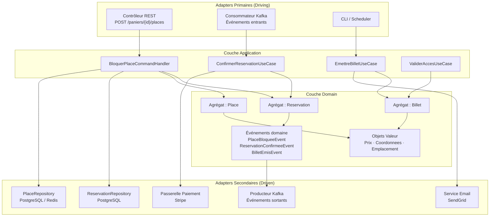

# Architecture hexagonale

## Description des couches

### 1. Couche Domain (Cœur métier)

La couche Domain est le noyau central de l'architecture. Elle contient l'ensemble des règles métier, des invariants et de la logique propre au domaine de la billetterie, sans aucune dépendance vers l'extérieur. On y trouve les agrégats (`Reservation`, `Place`, `Billet`), les objets valeur (`Prix`, `Coordonnees`, `Emplacement`), les interfaces des repositories et les événements domaine. Cette couche ignore totalement la façon dont les données sont persistées, comment les requêtes arrivent ou par quel canal les notifications sont envoyées. Elle est testable de manière isolée et évolue uniquement en réponse à des changements de règles métier.

### 2. Couche Application (Orchestration des cas d'usage)

La couche Application orchestre les interactions entre le domaine et le monde extérieur. Elle expose des **Use Cases** qui représentent les actions possibles du système : `CreerPanierUseCase`, `BloquerPlaceUseCase`, `ConfirmerReservationUseCase`, `EmettreBilletUseCase`, etc. Elle ne contient aucune logique métier propre ; elle appelle les agrégats du domaine, coordonne les repositories et publie les événements domaine. C'est également à ce niveau que sont gérées les transactions et les règles de sécurité transversales (autorisation).

### 3. Couche Adapters (Ports & Adaptateurs)

La couche Adapters constitue la frontière entre le domaine et le monde extérieur. Elle se décompose en deux catégories :

- **Adapters primaires (driving)** : ils initialisent les interactions vers le cœur. On y trouve les contrôleurs REST (API HTTP pour l'achat de billet, la gestion du panier), les consommateurs de messages (écoute des événements d'un broker comme Kafka ou RabbitMQ) et les interfaces en ligne de commande.
- **Adapters secondaires (driven)** : ils sont appelés par le domaine via des interfaces (ports). On y trouve les implémentations de repositories (persistance en base de données PostgreSQL, Redis pour le blocage temporaire), les clients vers des services externes (passerelle de paiement Stripe, service d'envoi d'emails), et les producteurs de messages pour la publication d'événements domaine.

---

## Exemple de flux (commande → réponse)

**Cas concret : Un spectateur bloque une place et démarre une réservation.**

1. **Adapter REST (primaire)** — Le spectateur envoie une requête `POST /paniers/{panierId}/places` via l'API HTTP. Le contrôleur REST désérialise la requête et construit une commande `BloquerPlaceCommand(panierId, seanceId, placeId, coordonnees)`.

2. **Couche Application** — Le `BloquerPlaceCommandHandler` reçoit la commande. Il charge l'agrégat `Reservation` via le `ReservationRepository` (port), puis délègue l'action au domaine.

3. **Couche Domain** — L'agrégat `Reservation` vérifie les invariants métier : la place est-elle encore disponible ? Le délai de 10 minutes est-il déjà dépassé ? La jauge de sécurité de la zone est-elle respectée ? Si tout est valide, il fait passer la `Place` à l'état `Bloquée` et émet un événement domaine `PlaceBloqueeEvent`.

4. **Adapter de persistance (secondaire)** — L'application persiste le nouvel état de l'agrégat via l'implémentation concrète du `ReservationRepository` (PostgreSQL) et enregistre le blocage temporaire dans Redis avec un TTL de 10 minutes.

5. **Adapter de messagerie (secondaire)** — L'événement `PlaceBloqueeEvent` est publié sur le broker de messages pour notifier les autres contextes (ex. : mise à jour du compteur d'inventaire en temps réel).

6. **Réponse** — Le contrôleur REST retourne un `HTTP 201 Created` avec les détails du panier mis à jour, incluant le délai d'expiration du blocage.

---

## Schéma

