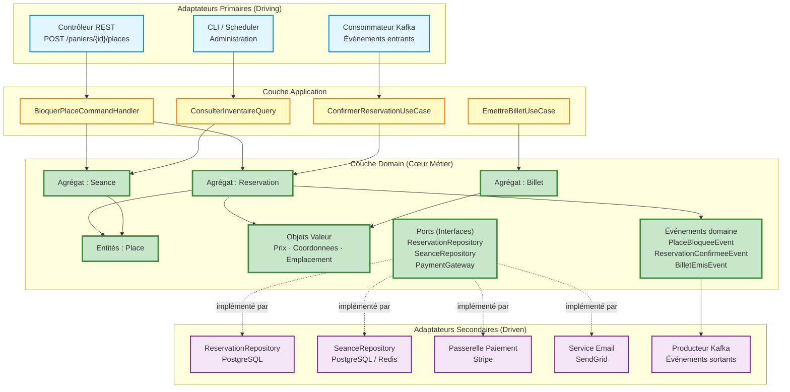

# Architecture hexagonale

## Description des couches

### 1. Couche Domain (Cœur métier)

La couche Domain est le noyau central de l'architecture. Elle contient l'ensemble des règles métier, des invariants et de la logique propre au domaine de la billetterie, **sans aucune dépendance vers l'extérieur**. On y trouve les agrégats (`Reservation`, `Seance`), les entités (`Place`, `Billet`), les objets valeur (`Prix`, `Coordonnees`, `Emplacement`), les interfaces des repositories (ports) et les événements domaine. Cette couche ignore totalement la façon dont les données sont persistées, comment les requêtes arrivent ou par quel canal les notifications sont envoyées. Elle est testable de manière isolée et évolue uniquement en réponse à des changements de règles métier. C'est ici que résident les invariants critiques qui protègent l'entreprise contre les pertes financières et les litiges clients.

### 2. Couche Application (Orchestration des cas d'usage)

La couche Application orchestre les interactions entre le domaine et le monde extérieur. Elle expose des **Use Cases** qui représentent les actions possibles du système, par exemple : 
- `BloquerPlaceUseCase` : blocage temporaire d'une place dans le panier
- `ConfirmerReservationUseCase` : validation définitive après paiement
- `AnnulerReservationUseCase` : libération des places expirées
- `EmettreBilletUseCase` : génération des billets avec QR codes
- `ConsulterInventaireQuery` : consultation de la disponibilité en temps réel

Elle ne contient aucune logique métier propre ; elle appelle les agrégats du domaine, coordonne les repositories et publie les événements domaine. C'est également à ce niveau que sont gérées les transactions applicatives et les DTOs (Data Transfer Objects) qui isolent le domaine des représentations externes.

### 3. Couche Adapters (Ports & Adaptateurs)

La couche Adapters constitue la frontière entre le domaine et le monde extérieur. Elle se décompose en deux catégories :

- **Adapters primaires (driving)** : ils initient les interactions vers le cœur. On y trouve les contrôleurs REST (API HTTP pour l'achat de billet, la gestion du panier), les consommateurs de messages (écoute des événements d'un broker comme Kafka ou RabbitMQ pour recevoir les confirmations de paiement) et les interfaces en ligne de commande (administration).

- **Adapters secondaires (driven)** : ils sont appelés par le domaine via des interfaces (ports). On y trouve les implémentations de repositories (persistance en base de données PostgreSQL, Redis pour le cache des blocages temporaires), les clients vers des services externes (passerelle de paiement Stripe, service d'envoi d'emails SendGrid), et les producteurs de messages pour la publication d'événements domaine vers les autres bounded contexts.

---

## Exemple de flux (commande → réponse)

### Cas concret : Un spectateur bloque une place et démarre une réservation

**Contexte** : Un spectateur consulte le plan de salle interactif et clique sur la place "Rang J, Siège 12" pour la séance du 15 juin à 20h00.

**1. Adapter REST (primaire)** — Le spectateur envoie une requête `POST /paniers/{panierId}/places` via l'API HTTP. Le contrôleur REST désérialise la requête JSON, valide le format des données et construit une commande métier `BloquerPlaceCommand(panierId, seanceId, placeId, coordonnees)`.

**2. Couche Application** — Le `BloquerPlaceCommandHandler` reçoit la commande. Il charge l'agrégat `Reservation` via le port `ReservationRepository`, récupère les informations de la séance via `SeanceRepository`, puis délègue l'opération métier au domaine en appelant `reservation.ajouterPlace(place, tarif)`.

**3. Couche Domain** — L'agrégat `Reservation` vérifie les invariants métier critiques :
   - La place est-elle encore disponible ? (Unicité temporelle)
   - Le délai de 10 minutes est-il déjà dépassé ? (Cohérence du cycle de vie)
   - La jauge de sécurité de la zone est-elle respectée ? (Respect de la capacité)
   
   Si tout est valide, l'agrégat fait passer la `Place` à l'état `Bloquée`, met à jour le montant total et émet un événement domaine `PlaceBloqueeEvent` avec l'expiration fixée à 10 minutes.

**4. Adapter de persistance (secondaire)** — L'application persiste le nouvel état de l'agrégat via l'implémentation concrète du `ReservationRepository` (PostgreSQL) et enregistre le blocage temporaire dans Redis avec un TTL de 10 minutes pour optimiser les vérifications de disponibilité.

**5. Adapter de messagerie (secondaire)** — L'événement `PlaceBloqueeEvent` est publié sur le broker de messages (RabbitMQ/Kafka) pour notifier les autres bounded contexts de manière asynchrone. Le Contexte Billetterie peut ainsi préparer la génération future du billet, et le système de reporting peut mettre à jour les statistiques d'inventaire en temps réel.

**6. Réponse** — Le contrôleur REST construit un DTO `ReservationDTO` et retourne une réponse `HTTP 201 Created` avec les détails du panier mis à jour : identifiant de réservation, liste des places bloquées, montant total provisoire et timestamp d'expiration (dans 10 minutes). Le client web affiche un compte à rebours et met à jour l'interface utilisateur.

---

## Schéma de l'architecture

### Légende du schéma

- **Flèches pleines (→)** : Dépendances directes et flux de contrôle d'exécution
- **Flèches pointillées (-.->)** : Implémentation des interfaces (ports) définies par le Domain
- **Couleur bleue** : Adaptateurs primaires qui déclenchent les use cases
- **Couleur jaune** : Couche Application qui orchestre sans logique métier
- **Couleur verte** : Couche Domain totalement isolée, aucune dépendance externe
- **Couleur violette** : Adaptateurs secondaires qui implémentent les ports
