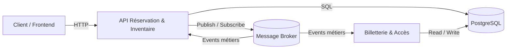

# Architecture runtime

La vue runtime repose sur une orchestration Docker Compose qui démarre au minimum trois services : une API métier, une base de données et un broker de messages.
Dans le contexte de la billetterie, l’API correspondrait au service Réservation & Inventaire, exposé sur un port HTTP pour recevoir les requêtes externes.
La base de données serait dédiée à ce service afin de stocker les réservations, les places bloquées et les dates d’expiration.
Le broker jouerait le rôle d’infrastructure d’échange pour les événements métiers comme `PaiementTraite` ou `ReservationConfirmee`.
Les services seraient reliés par un réseau Docker commun, ce qui leur permet de communiquer par noms de service sans exposer les composants internes.
L’API se connecte à la base de données via une chaîne de connexion injectée par variable d’environnement.
L’API publie et consomme des messages via le broker pour découpler la confirmation de paiement et la génération des billets.
La base de données ne communique pas directement avec le broker : elle reste un stockage persistant isolé.
Le broker peut aussi être observé par d’autres services runtime du système, comme Paiement ou Billetterie & Accès, si l’on étend la composition.
Cette organisation permet de simuler localement le comportement du système complet tout en gardant des responsabilités claires entre les composants.

## Schéma (image)

## Liens entre services

- Le client consomme l’API via HTTP pour créer une réservation ou initier un paiement.
- L’API persiste son état dans la base de données dédiée.
- Le broker transporte les événements asynchrones entre les contextes.
- La billetterie peut écouter le broker pour déclencher la génération des billets après confirmation.
- Le réseau Docker commun permet aux services de dialoguer sans adresse publique fixe.