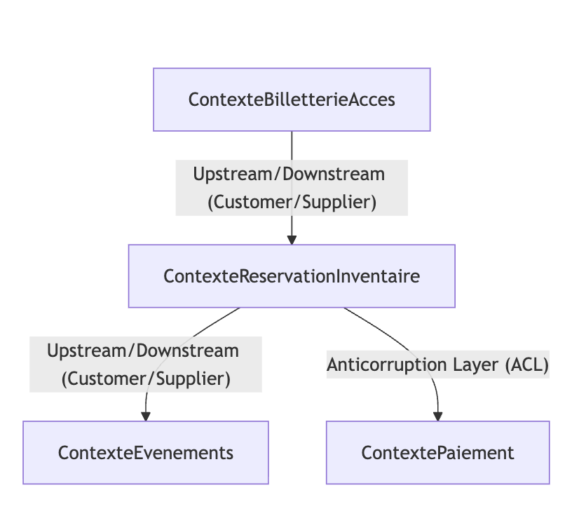

# Context Map

## Schéma général

## Relations et patterns

| Contexte source                   | Contexte cible                   | Pattern de relation                 | Justification |
|----------------------------------|----------------------------------|-------------------------------------|---------------|
| Contexte Réservation & Inventaire | Contexte Evenements               | Customer / Supplier                 | La Réservation consomme les données des événements. L'équipe Evenements (Supplier) travaille pour fournir les informations nécessaires à la vente (tarifs, plans) au moteur de réservation (Customer). |
| Contexte Réservation & Inventaire | Contexte Paiement                 | Anticorruption Layer (ACL)          | Le Paiement est un service générique. La Réservation utilise une ACL pour traduire les réponses bancaires et protéger son modèle métier des changements techniques du prestataire externe. |
| Contexte Billetterie & Accès      | Contexte Réservation & Inventaire | Customer / Supplier                 | La Billetterie a besoin des confirmations de vente du Core Domain pour générer les billets. Elle dépend des données fournies par le moteur de réservation après chaque transaction réussie. |

## Intégrations techniques envisagées

1. **Appel API REST (Synchrone)**:

* **BC impliqués** : Contexte Réservation & Inventaire  Contexte Programmation.
* **Cas d'usage** : Lors de la sélection d'une place, le moteur de réservation interroge en temps réel le référentiel de programmation pour valider les tarifs et la configuration de la séance choisie.

2. **Événements via Broker (Asynchrone)**:

* **BC impliqués** : Contexte Réservation & Inventaire  Contexte Billetterie & Accès.
* **Cas d'usage** : Une fois le paiement validé, un événement `TransactionConfirmee` est publié. Le contexte Billetterie consomme cet événement pour déclencher la génération asynchrone des billets et l'envoi du mail de confirmation sans bloquer le flux de vente.

3. **Webhook / Callback (Asynchrone)**:

* **BC impliqués** : Contexte Paiement  Contexte Réservation & Inventaire.
* **Cas d'usage** : Après la saisie des coordonnées bancaires par le client sur une interface externe, le contexte Paiement reçoit une notification du prestataire. Il transmet ensuite le statut `PaiementApprouve` au contexte de Réservation pour finaliser la commande.