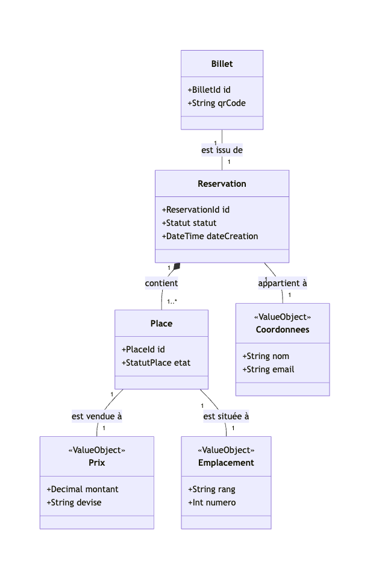

# Modèle de domaine

## Entités

| Entité      | Description métier | Identifiant métier |
|-------------|--------------------|--------------------|
| Reservation | Représente l'engagement temporaire ou définitif d'un spectateur pour une ou plusieurs places. Elle gère le cycle de vie complet, du blocage initial dans le panier jusqu'à la validation finale après paiement. C'est l'entité centrale pour garantir l'intégrité de la vente et le respect du délai de 10 minutes. | ReservationId |
| Place       | Unité d'inventaire unique pour une séance donnée. Elle possède un état (Disponible, Bloquée, Vendue) qui évolue selon les interactions des spectateurs. Elle est rattachée à une zone spécifique et peut être associée à un siège physique précis dans le plan de salle. | PlaceId |
| Billet      | Titre d'accès final généré uniquement après confirmation d'une transaction réussie. Il contient les informations de sécurité nécessaires au contrôle d'accès, comme le QR Code unique. Il lie juridiquement le bénéficiaire à son droit d'entrée pour une séance spécifique. | BilletId |

## Objets Valeur

| Objet Valeur | Description métier | Propriétés principales |
|--------------|--------------------|------------------------|
| Prix         | Encapsule la valeur monétaire d'une place ou d'une commande. Il est immuable car une valeur de "50 EUR" ne change pas ; si le prix change, on remplace l'objet par un nouveau. | Montant, Devise |
| Coordonnees  | Regroupe les informations de contact de l'acheteur (nom, prénom, email). Ces informations sont traitées comme un tout cohérent pour l'envoi des confirmations et des billets. | Nom, Prenom, Email |
| Emplacement  | Définit la localisation physique précise d'un siège au sein du lieu. Il combine les informations de rang et de numéro pour identifier la place sur le plan de salle. | Rang, NumeroSiege |

## Diagramme UML (conceptuel)

