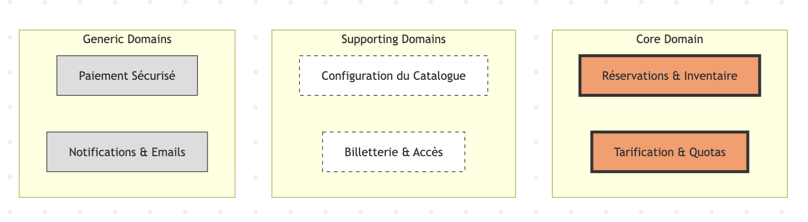

# Vue d'ensemble du domaine
## Liste des fonctionnalités

- **Gestion du catalogue et configuration des événements** : Paramétrage complet des séances, des lieux et des plans de salle associés.
- **Moteur de réservation et gestion d'inventaire en temps réel** : Mécanisme critique de blocage temporaire et de mise à jour des stocks pour éviter les doubles réservations lors des pics de charge.
- **Tarification dynamique et gestion des réductions** : Application de règles complexes de prix (étudiants, groupes, abonnés) et vérification des justificatifs d'éligibilité.
- **Processus de paiement sécurisé** : Interface avec les prestataires bancaires externes pour valider les transactions financières.
- **Émission et sécurisation des titres d'accès** : Génération de billets numériques infalsifiables intégrant des QR Codes uniques.
- **Contrôle d'accès et validation des entrées** : Système de scan en temps réel à l'entrée du lieu pour vérifier la validité des accès et lutter contre la fraude.
- **Reporting et analyse des ventes** : Tableaux de bord permettant à la direction de suivre le remplissage des salles et d'optimiser la stratégie tarifaire.

## Classification des sous-domaines

| Fonctionnalité                     | Type (Core / Supporting / Generic) | Justification |
|-----------------------------------|------------------------------------|---------------|
| Gestion des réservations & Inventaire | Core Domain | C'est le cœur de la valeur ajoutée qui gère la haute concurrence et garantit l'absence de double réservation. La performance du système lors des pics de charge est le facteur différenciateur majeur de l'organisation. |
| Tarification & Quotas             | Core Domain | Ce module contient les règles métier complexes d'optimisation des revenus et de gestion des catégories. Il permet à l'institution de se différencier par une stratégie commerciale flexible et réactive. |
| Configuration du Catalogue        | Supporting Domain | Cette fonctionnalité est indispensable pour faire fonctionner le système mais n'est pas une source directe d'avantage concurrentiel. Elle supporte le Core Domain en fournissant les données structurelles nécessaires. |
| Gestion des Billets & Accès       | Supporting Domain | Bien qu'essentiel pour l'exploitation et la lutte contre la fraude, ce domaine reste secondaire par rapport à l'acte de vente initial. Il s'agit d'une brique opérationnelle nécessaire au flux complet. |
| Paiement sécurisé                 | Generic Domain | La gestion des transactions financières est une fonctionnalité standardisée déléguée à des prestataires spécialisés (type Stripe ou PayPal). Il s'agit d'une commodité métier commune à toutes les plateformes e-commerce. |
| Notifications & Emails            | Generic Domain | L'envoi de confirmations et de billets par voie électronique repose sur des services de messagerie standards. C'est un service utilitaire qui ne demande aucune logique métier spécifique à la billetterie. |

