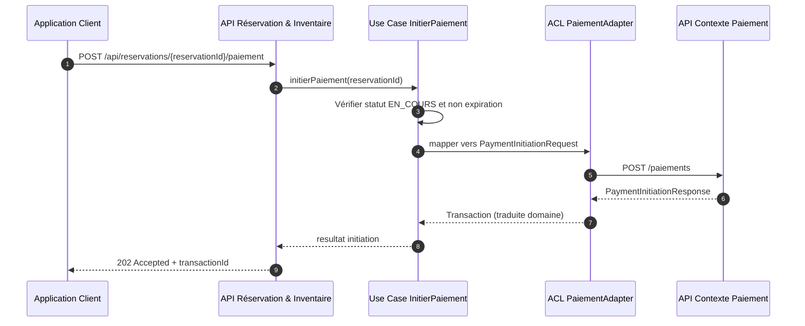
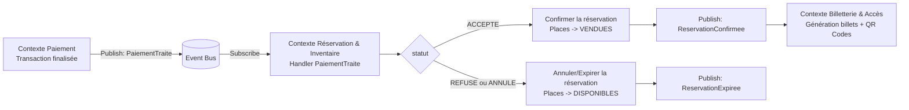

# Design des intégrations inter-contextes

Ce document décrit le design cible des échanges entre contextes pour le système de billetterie, sans implémentation technique détaillée.

## Intégration REST

### Schéma (image)

### Narration

Le client déclenche le paiement depuis une réservation existante via un endpoint REST du contexte Réservation & Inventaire.
Le cas d’usage vérifie d’abord les invariants métier : réservation encore en cours et non expirée.
Le modèle interne n’est jamais exposé directement au contexte Paiement, car une ACL traduit les données.
La requête sortante est normalisée selon le contrat JSON de paiement, avec montant, devise et identité client.
Le contexte Paiement retourne un statut de transaction et un identifiant technique de suivi.
L’ACL reconvertit cette réponse en objet compréhensible par le Core Domain.
La réponse REST au client confirme l’initiation du paiement, sans confirmer la vente à ce stade.
La confirmation finale restera pilotée par le résultat réel du paiement, traité dans une intégration asynchrone.

## Intégration par événements

### Schéma (image)

### Narration

Le contexte Paiement publie l’événement `PaiementTraite` dès qu’une transaction atteint un état final.
Le bus d’événements distribue ce message aux abonnés sans couplage fort entre contextes.
Le contexte Réservation & Inventaire consomme l’événement et applique la transition d’état métier correspondante.
Si le paiement est accepté, la réservation devient confirmée et les places passent à l’état vendues.
Si le paiement est refusé ou annulé, la réservation est annulée et les places sont immédiatement relibérées.
Les changements d’état produisent à leur tour des événements de domaine pour les contextes downstream.
Le contexte Billetterie & Accès réagit à `ReservationConfirmee` pour générer les billets et QR codes uniques.
Cette approche asynchrone améliore la résilience, limite les dépendances temporelles et protège le cœur métier.