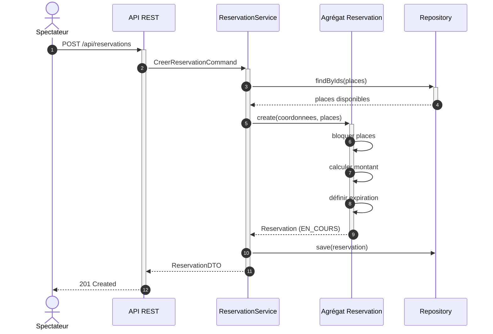
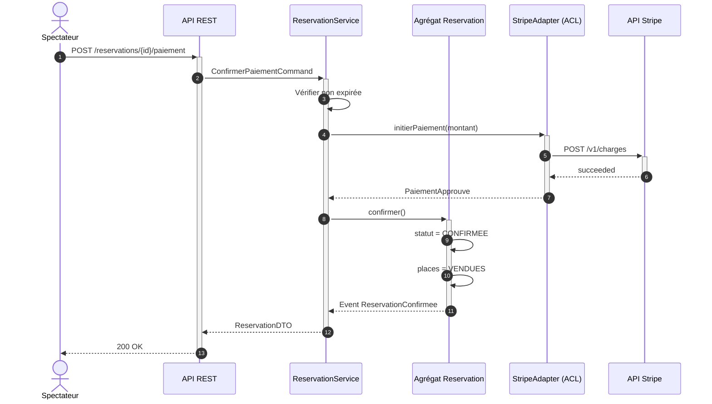
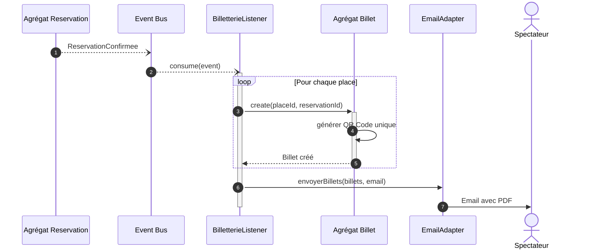
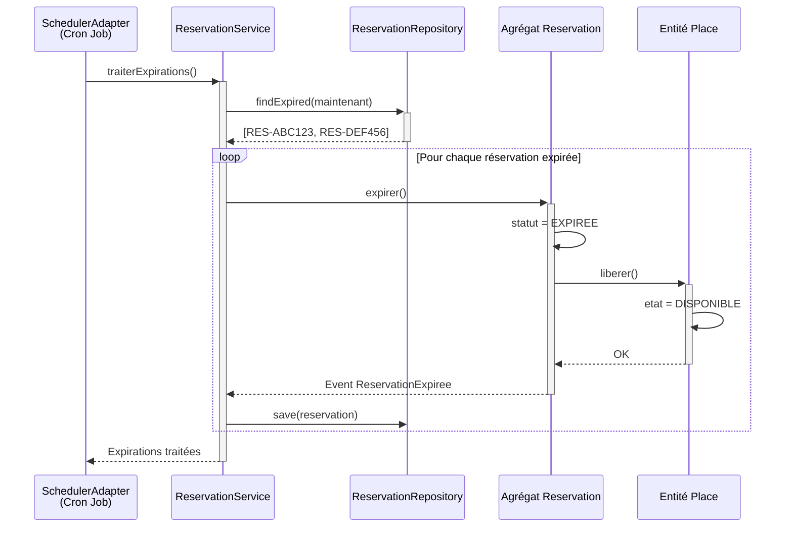

# Scénarios d'intégration

## Scénario 1 : Achat complet d'un billet (End-to-End)

### Contexte métier

Un spectateur souhaite acheter des places pour un concert. Ce scénario couvre l'ensemble du parcours d'achat, depuis la sélection des places jusqu'à la réception du billet électronique avec QR Code.

### Bounded Contexts impliqués

| Bounded Context | Rôle dans le scénario |
|-----------------|----------------------|
| **Réservation & Inventaire** (Core) | Création de la réservation, blocage temporaire des places, calcul du montant |
| **Paiement** (Generic) | Traitement de la transaction financière via ACL |
| **Billetterie & Accès** (Supporting) | Génération du billet et du QR Code unique |

---

### Narration du scénario

**Étape 1 - Réception de la requête externe :**  
Sophie Dupont, via l'application mobile, sélectionne 2 places (rang J, sièges 12 et 13) pour le concert du 15 juin 2026. L'application envoie une requête HTTP `POST /api/reservations` au contrôleur REST de l'API Gateway.

**Étape 2 - Traversée de la couche Adapter (entrée) :**  
L'adaptateur REST (couche Adapters) reçoit le JSON contenant les coordonnées de Sophie (`nom`, `email`) et la liste des `placeId` demandées. Il désérialise les données et construit une commande applicative `CreerReservationCommand`.

**Étape 3 - Exécution du cas d'usage (couche Application) :**  
Le service applicatif `ReservationService` orchestre l'opération. Il interroge d'abord le `PlaceRepository` (via le port sortant) pour vérifier la disponibilité des places. Les places étant libres, il invoque la fabrique de l'agrégat `Reservation` pour créer une nouvelle instance avec le statut `EN_COURS` et une expiration à 10 minutes.

**Étape 4 - Application des règles métier (couche Domain) :**  
L'agrégat `Reservation` applique les invariants : il calcule le `montantTotal` (somme des `Prix` des places), bloque les places en mettant leur `etat` à `BLOQUEE`, et définit la `dateExpiration`. Un événement de domaine `ReservationCreee` est émis.

**Étape 5 - Persistance (couche Adapter sortie) :**  
L'adaptateur `PostgresReservationRepository` (implémentation du port `ReservationRepository`) persiste l'agrégat en base de données. Le contrôleur REST retourne une réponse `201 Created` avec le `reservationId`.

**Étape 6 - Paiement (traversée vers Bounded Context Paiement) :**  
Sophie valide son panier et lance le paiement. Le `ReservationService` appelle le port sortant `PaiementGateway`. L'ACL (Anti-Corruption Layer) traduit les données métier vers le format attendu par le prestataire Stripe. La transaction est approuvée.

**Étape 7 - Confirmation et mise à jour du domaine :**  
Suite à l'événement `PaiementApprouve`, le service applicatif appelle `reservation.confirmer()`. L'agrégat change son `statut` à `CONFIRMEE` et marque les places comme `VENDUES`. Un événement `ReservationConfirmee` est émis.

**Étape 8 - Génération des billets (Bounded Context Billetterie & Accès) :**  
Le listener d'événements du contexte Billetterie écoute `ReservationConfirmee`. Il crée un agrégat `Billet` pour chaque place, génère un `qrCode` unique, et persiste les billets. Un email de confirmation avec les billets en PDF est envoyé à Sophie.

---

### Diagrammes de séquence UML

Les diagrammes sont découpés en 3 phases distinctes pour plus de lisibilité.

#### Phase 1 : Création de la réservation

#### Phase 2 : Paiement et confirmation

#### Phase 3 : Génération des billets (asynchrone)

---

## Scénario 2 : Expiration automatique d'une réservation

### Narration

Une réservation non payée dans les 10 minutes doit être automatiquement libérée pour permettre à d'autres spectateurs d'acheter les places.

**Étape 1 :** Un job schedulé (Adapter entrée de type `@Scheduled`) s'exécute toutes les minutes et appelle le `ReservationService` pour traiter les expirations.

**Étape 2 :** Le service interroge le repository pour trouver les réservations avec `statut = EN_COURS` et `dateExpiration < maintenant`.

**Étape 3 :** Pour chaque réservation expirée, le domaine est invoqué : `reservation.expirer()`. L'agrégat change son statut à `EXPIREE` et libère les places (`etat = DISPONIBLE`).

**Étape 4 :** Un événement `ReservationExpiree` est émis, permettant au système de notifier le spectateur par email.

---

## Synthèse des interactions inter-contextes

| Source | Destination | Type de relation | Mécanisme |
|--------|-------------|------------------|-----------|
| Réservation & Inventaire | Paiement | ACL (Anticorruption Layer) | Appel synchrone via adapter |
| Réservation & Inventaire | Billetterie & Accès | Upstream/Downstream | Événement asynchrone `ReservationConfirmee` |
| Billetterie & Accès | Notifications | Published Language | Email avec PDF attaché |

Ces scénarios démontrent comment l'architecture hexagonale isole le domaine métier tout en permettant l'intégration avec les systèmes externes via des adapters bien définis.
