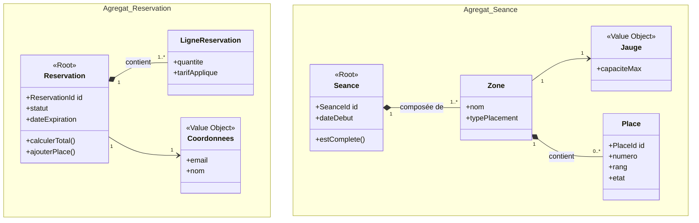

# Agrégats et invariants

## 1. Agrégat : Reservation

Cet agrégat est le cœur du processus transactionnel. Il est responsable de garantir qu'une commande est constituée de places valides, attribuées à un acheteur, et qu'elle respecte les délais impartis avant de devenir définitive.

*   **Racine de l'agrégat (Aggregate Root) :** `Reservation` (Entité)
*   **Entités/OV internes :**
    *   `LigneReservation` (Entité locale : associe une Place à un Tarif au sein de la réservation)
    *   `Coordonnees` (Objet Valeur : contact de l'acheteur)
    *   `MontantTotal` (Objet Valeur : somme des prix)
    *   `StatutReservation` (Objet Valeur : EnCours, Confirmée, Annulée)
    *   `Expiration` (Objet Valeur : timestamp de fin du blocage temporaire)

### Tableau des invariants

| Invariant | Description métier | Conséquence si non respecté |
| :--- | :--- | :--- |
| **Unicité temporelle des places** | Une réservation ne peut contenir des places qui sont déjà verrouillées dans une autre réservation active (statut "En cours" ou "Confirmée") sur le même créneau horaire. Le système doit garantir l'exclusivité du blocage. | Risque majeur de **double réservation** (surbooking). Deux clients paieraient pour le même siège, entraînant des litiges et une perte de confiance critique. |
| **Cohérence du cycle de vie limité** | Une réservation au statut "En cours" doit posséder une date d'expiration valide (ex: 10 minutes). Si le paiement n'est pas validé avant cette date, la réservation doit transiter vers un état "Expirée" et libérer ses lignes. | Les places resteraient bloquées indéfiniment sans paiement ("stock mort"), empêchant d'autres clients de les acheter et faussant le taux de remplissage réel. |
| **Intégrité du montant total** | Le montant total de la réservation doit toujours être strictement égal à la somme des prix des lignes de réservation, moins les éventuelles réductions appliquées globalement. Il ne peut jamais être négatif. | Incohérence comptable et financière. L'entreprise pourrait perdre de l'argent ou facturer le mauvais montant au client lors de l'appel au service de paiement. |

---

## 2. Agrégat : PlanDeSalle (Configuration Séance)

Cet agrégat modélise l'offre disponible pour une séance donnée. Il structure l'inventaire physique et logique, garantissant que la vente respecte les capacités d'accueil du lieu.

*   **Racine de l'agrégat (Aggregate Root) :** `Seance` (Entité)
*   **Entités/OV internes :**
    *   `Zone` (Entité : subdivision de la salle)
    *   `Jauge` (Objet Valeur : capacité max)
    *   `Place` (Entité : siège unitaire)
    *   `CategorieDePlace` (Objet Valeur : classification tarifaire)

### Tableau des invariants

| Invariant | Description métier | Conséquence si non respecté |
| :--- | :--- | :--- |
| **Respect de la Jauge physique** | Le nombre total de places mises en vente (numérotées ou en placement libre) pour une zone donnée ne doit jamais excéder la capacité maximale (Jauge) définie par les règles de sécurité du lieu. | Violation des normes de sécurité incendie et légales. En cas de contrôle ou d'incident, la responsabilité pénale des organisateurs serait engagée. |
| **Unicité de l'emplacement** | Au sein d'une même séance, un couple (Rang, Numéro) identifiant une place numérotée doit être absolument unique. Il est impossible d'avoir deux sièges physiques portant le même identifiant. | Le système proposerait la vente de "places fantômes" ou dupliquées. Les spectateurs se retrouveraient à plusieurs pour un seul siège physique dans la salle. |
| **Appartenance exclusive** | Une Place doit appartenir à une et une seule Zone, et une Zone doit appartenir à un et un seul Plan de Salle. Il ne peut y avoir d'orphelins ou de partages transversaux dans la structure hiérarchique. | Corruption de la structure de l'inventaire. Impossible de calculer correctement les taux de remplissage par zone ou d'appliquer des règles de tarification ciblées. |

---

## Schéma UML des agrégats

*(Note : Ce schéma illustre les frontières définies ci-dessus. Les racines sont marquées par le stéréotype <<Root>>)*

